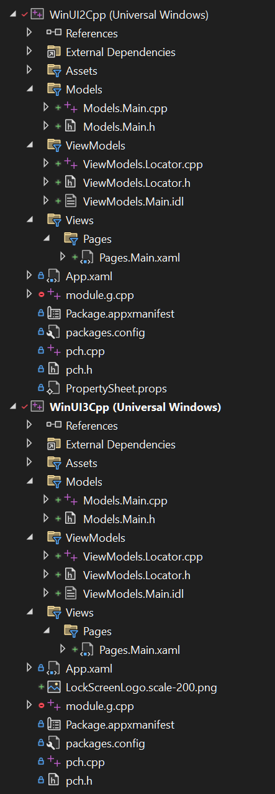

# MVVM in UWP with C++/WinRT
This is **the** simplest, **the** easiest-to-understand MVVM pattern implemented in UWP development with C++/WinRT.

## Why?
I've never seen a clean, simple explanation to MVVM without bringing too much extra logic. Even Microsoft themselves is advocating the use of MVVM in their UWP development guide, 
but I found no explanation specific to C++/WinRT development. Especially when using C++/WinRT there is an extra `idl` file that you kind of have to declare your interface with 
which would be a "Windows Runtime class", while you could also write a class without it, being not a "Windows Runtime class" that is simply more confusing. 
This tiny project demonstrate how to implement MVVM pattern with the least amount of code I've ever seen.

## What is MVVM?
Model-view-view model. This is such a BAD abbreviation, because it makes a beginner think that both "model" and "view model" talks to the "view", thus "view" feels like the central thing.

The real pattern is actually:
```
View <=> ViewModel <=> Model
```

## How?
In UWP with C++/WinRT's term, you basically do this

+ Page.xaml			(write your GUI here, this is actually the "view" part)
	- `Page.idl`		(declare your data binding with idl language, no events here, also import the view model's idl file)
	- `Page.xaml.h`	(rewrite your declared data binding in the idl file with C++ language, xaml event handler method declaration would be automatically generate in here)
	- `Page.xaml.cpp` (all methods should simply call methods from ViewModel, with minimum code)

+ PageViewModel 
	- `PageViewModel.idl` (declare your methods that this view model should support, eg. methods that returning data & handle events)
	- `PageViewModel.h`	(rewrite your declared methods with C++ language, with optional extra data members recording the states of the view)
	- `PageViewModel.cpp` (methods should call methods from model accordingly, transform the data for display according to states, firing property changed events when model's data changed)

+ Model				(your busines logic)
	- `Model.h`	
	- `Model.cpp`


Generally, if the "view model" only support one kind of "view" (which should be the majority of the time), you create a total of **9** files for each page/view/controls.
```
<Page>.xaml
<Page>.idl
<Page>.xaml.h
<Page>.xaml.cpp

<Page>ViewModel.idl
<Page>ViewModel.h
<Page>ViewModel.cpp

<Your Business Logic>Model.h
<Your Business Logic>Model.cpp
```

## Every tutorial says it's good for unit-testing. Test what?
- Test your "view model" code using mocking of your "model" to ensure the correctness of the interface logic.
- Test your "model" code with traditional unit tests to ensure the correctness of the business logic.
- You don't test your "view" code.

## This example

### UI
This example is has an initial window with a button and a text box with an initial text saying "Not Ready".

<p style="text-align: center;">WinUI3</p>


<p style="text-align: center;">WinUI2</p>


When the button is clicked, the "model" does sleep for some time simulating some expensive computation to be done,
and change the text to "Ready" upon finishing.

<p style="text-align: center;">WinUI3</p>


<p style="text-align: center;">WinUI2</p>

Although the whole process is extremely minimal, it contains all the important concepts of implementing MVVM pattern:
- `OneWay` Mode data binding (`TwoWay` binding only requires minimal amount of changes)
- Async functions
- Interop between Windows APIs <-> C++ std library
- Handling property change events

### Code
You'd better open the project in **Visual Studio**.
The project is written in both **WinUI2** & **WinUI3**, showing some minor code changes that you need to be aware of, 
and there will be a project that has identical structure for each of them.



For toolchain requirement, read [this](https://docs.microsoft.com/en-us/windows/apps/windows-app-sdk/set-up-your-development-environment?tabs=vs-2022). Basically you should have these extensions to be able to build it.


The code is fully commented, read them in this order:
```
MainPage.xaml
MainPage.idl
MainPage.xaml.h
MainPage.xaml.cpp

ViewModel.idl
ViewModel.h
ViewModel.cpp

Model.h
Model.cpp
```